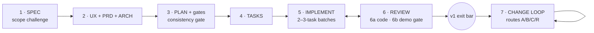

# Brana

**A 7-phase app-development workflow for AI coding agents that gates on the running app, not green tests.**

[](LICENSE)
[](CHANGELOG.md)
[](#installation)

The failure mode Brana guards against: **every task green, every doc consistent-looking, app unusable.** Most agent workflows stop at code review — nothing ever launches the app, walks a user journey, or judges a screen. Brana's countermeasure is a set of contract documents plus a human demo gate every 2–3 tasks: you launch the build and walk a scripted journey before feature work continues.

## The seven phases



| Phase | Skill | Produces |
|---|---|---|
| 1 — Spec | `brana-1-spec` | `SPEC.md` (kernel/v1/backlog + kernel journey) |
| 2 — Product & architecture | `brana-2-prd-arch` | `UX.md`, `PRD.md`, `ARCHITECTURE.md` |
| 3 — Plan | `brana-3-plan` | `PLAN.md`, `CONVENTIONS.md`, `DESIGN.md`, `FILE_STRUCTURE.md` + consistency gate |
| 4 — Tasks | `brana-4-tasks` | `TASKS.md` with context packs + demo-gate tasks |
| 5 — Implement | `brana-5-implement` | code + tests + commit, *demonstrated* |
| 6 — Review | `brana-6-review` | 6a code review (diffs) + 6b product walkthrough |
| 7 — Change loop | `brana-7-change` | post-v1 changes routed A/B/C/R + doc sync |

Full canon: [WORKFLOW.md](WORKFLOW.md). Skill-by-skill guide: [skills/USAGE.md](skills/USAGE.md).

## What makes Brana different

- **The deliverable is the running app, not the documents.** Done = demonstrated in the real app, with live verification evidence recorded per task.
- **6b demo gate.** Every 2–3 tasks *you* launch the build and walk one scripted journey from UX.md. Findings become tasks before new features proceed. Skips are logged as visible debt, never silent.
- **UX.md** — the artifact most workflows skip. Screen inventory, navigation map, per-screen wireframes with empty/loading/error states. Without it, every task improvises its own interface.
- **Scope cuts are hard stops.** An agent that discovers a spec'd behavior won't be built must stop and ask — documenting the cut in a gotchas file is laundering, not a decision.
- **Copy-paste is canon.** Every prompt works by a human moving text between chat UIs — zero tooling required. Agent harnesses (Claude Code etc.) are an adaptation layer on top, not a dependency.
- **Cheap by design.** Expensive model plans, cheap model codes; fresh session per phase; diff-only reviews. Concrete model bindings included.

See [COMPARISON.md](COMPARISON.md) for an honest side-by-side with [Superpowers](https://github.com/obra/superpowers) and [Compound Engineering](https://github.com/EveryInc/compound-engineering) — including what Brana adopted from each and where they're stronger.

## Installation

### Zero tooling (any chat UI — ChatGPT, Gemini, Claude.ai, …)

Nothing to install. Open [WORKFLOW.md](WORKFLOW.md), copy the prompt for the phase you're in, paste it into your chat UI, commit the output files to your repo. This is the workflow's native medium.

### Claude Code

As a plugin (recommended):

```bash
/plugin marketplace add nabidam/brana
/plugin install brana@brana
```

Or copy the skills directly:

```bash
git clone https://github.com/nabidam/brana
cp -r brana/skills/brana-* ~/.claude/skills/
```

Then in any project: `/brana-1-spec` to start, or just describe your app idea — the skills self-trigger.

### Cursor, Codex, Copilot CLI, Gemini CLI, and other agent tools

Brana's skills are plain markdown with YAML frontmatter — no hooks, no scripts, no dependencies. Copy the `skills/brana-*` folders into your tool's skills/instructions directory, or point your tool's instructions file (`AGENTS.md`, `.cursorrules`, `GEMINI.md`, …) at `WORKFLOW.md`:

```markdown
Follow the Brana workflow defined in WORKFLOW.md. Phase skills live in skills/.
```

If your tool has no skill mechanism at all, use the zero-tooling path — every skill also has a `prompt` mode that emits paste-ready blocks.

## Quick start

```
1. /brana-1-spec      → describe your idea; get SPEC.md with a kernel + scope challenge
2. /brana-2-prd-arch  → UX.md + PRD.md + ARCHITECTURE.md   (read UX.md yourself!)
3. /brana-3-plan      → PLAN.md + conventions + design system + consistency gate
4. /brana-4-tasks     → TASKS.md
5. /brana-5-implement → 2–3-task batches; halt at each demo gate
6. /brana-6-review    → code review + product walkthrough
   …repeat 5–6 to the v1 exit bar…
7. /brana-7-change    → everything after v1
```

Run each phase in a **fresh session**. Read `SPEC.md` and `UX.md` yourself (~20 min each) — they encode intent, which no machine check verifies. Walk the demo gates.

## Repository layout

```
WORKFLOW.md        the canon — the complete workflow, self-contained
COMPARISON.md      Brana vs Superpowers vs Compound Engineering
skills/            one skill per phase (brana-1-spec … brana-7-change)
  README.md        phase ↔ skill map
  USAGE.md         detailed per-skill guide
docs/history/      pre-release drafts
```

## Contributing

Issues and PRs welcome — see [CONTRIBUTING.md](CONTRIBUTING.md). The one house rule: every line must change agent behavior — if deleting it would not change the output, delete it.

## License

[MIT](LICENSE)
