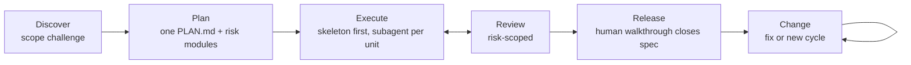

# Brana

**A token-efficient app-development workflow for AI coding agents that gates on the running app, not green tests.**

[](LICENSE)
[](CHANGELOG.md)
[](#installation)

The failure mode Brana guards against: **every task green, every doc consistent-looking, app unusable.** Most agent workflows stop at code review — nothing ever launches the app, walks a user journey, or judges a screen. Brana's countermeasure: a kernel journey anchoring one canonical plan, a walking skeleton first, and a human walkthrough of the release build before anything ships.

v2.0 is a ground-up token-efficiency redesign. Two independent audits of v1
(`docs/2026-07-30-brana-workflow-audit.md`, `ANALYSIS-brana-vs-superpowers.md`)
found v1's nine-artifact document graph and gate stack cost 12–15× the document
traffic of comparable workflows. v2 keeps every control that found real bugs
and deletes the apparatus that only policed drift between v1's own documents.

## The flow



| Skill | Covers | Produces |
|---|---|---|
| `brana-plan` | Discover + Plan | `specs/NNN-name/PLAN.md` — the single canonical artifact |
| `brana-build` | Execute + Review | code + tests per unit, demonstrated; `.brana/ledger.md` |
| `brana-ship` | Release + Change | walkthrough close-out, change routing, doc sync |

Full canon: [WORKFLOW.md](WORKFLOW.md). Golden path: [skills/USAGE.md](skills/USAGE.md).

## What makes Brana different

- **The deliverable is the running app.** Done = demonstrated in the real app or by a test that actually drives the behavior.
- **One canonical plan.** Goal, kernel journey, requirements with stable IDs, risk sections, units, verification contract, walkthrough script — one document, enriched in place. No SPEC/UX/PRD/TASKS constellation to keep synchronized.
- **Risk modules instead of profiles.** Money, external systems, migrations, UI, auth, operator surfaces, deployment — each activates its own planning section and review depth. A project pays only for the risks it has.
- **Walking skeleton + one kernel e2e.** The kernel journey passes end-to-end in the real app before feature deepening; one e2e test written once guards it on every unit.
- **The walkthrough closes the spec.** One mandatory human gate: you walk the kernel journey plus edge behaviors on a preflighted release build. Mid gates are pull-based — say "show me" any time, zero ceremony.
- **Scope cuts are hard stops.** An agent that discovers a spec'd behavior won't be built must stop and ask — documenting the cut in a side file is laundering, not a decision.
- **Cache-friendly by design.** One persistent controller session per cycle; subagents get path-based packets, never pasted prose; no mandated session flushes.
- **A removal policy.** Every rule states what activates it and what would justify deleting it. Cost claims require measured runs.

See [COMPARISON.md](COMPARISON.md) for the side-by-side with [Superpowers](https://github.com/obra/superpowers) and [Compound Engineering](https://github.com/EveryInc/compound-engineering).

## Installation

### Universal

```bash
npx skills add https://github.com/nabidam/brana
```

### Claude Code

```bash
/plugin marketplace add nabidam/brana
/plugin install brana@brana
```

Or copy the skills directly:

```bash
git clone https://github.com/nabidam/brana
cp -r brana/skills/brana-* ~/.claude/skills/
```

Skill-only installs are self-contained: `brana-plan` bundles the canon
(`reference/WORKFLOW.md`) and the gate script (`scripts/brana_gate.py`);
the other two skills resolve both via `../brana-plan/`, so always install
the three together. `tools/check-dist.sh` verifies the bundle matches the
source.

Then in any project: `/brana-plan` to start, or just describe your app idea — the skills self-trigger.

### Cursor, Codex, Copilot CLI, Gemini CLI, and other agent tools

Skills are plain markdown with YAML frontmatter — no hooks, no dependencies. Copy the `skills/brana-*` folders into your tool's skills directory, or point your instructions file (`AGENTS.md`, `.cursorrules`, `GEMINI.md`, …) at the canon:

```markdown
Follow the Brana workflow defined in WORKFLOW.md. Skills live in skills/.
```

## Quick start

```
1. /brana-plan    → interview + scope challenge + risk modules → PLAN.md
                    (read PLAN.md §§1–3 yourself — ~15 min, the intent check)
2. /brana-build   → walking skeleton → kernel e2e → subagent per unit
                    → "show me" any time for a live demo
3. /brana-ship    → you walk the release build; findings → fix units → merge
```

## Repository layout

```
WORKFLOW.md          the canon — the complete workflow, self-contained
COMPARISON.md        Brana vs Superpowers vs Compound Engineering
skills/              brana-plan (bundles canon + gate) · brana-build · brana-ship
tools/brana-gate     deterministic checks: docs, claims (Python 3.11+, stdlib only)
tools/check-dist.sh  fails if the skill bundle drifts from the source
examples/notes-v2/   v2 fixture cycle (PLAN.md + ledger); dally/ is archived v1
docs/                audits, v2 baseline + review, history
```

## Contributing

Issues and PRs welcome — see [CONTRIBUTING.md](CONTRIBUTING.md). House rules: every line must change agent behavior, and every new rule must state its activation and removal conditions.

## License

Under [MIT](LICENSE) License 2026.
